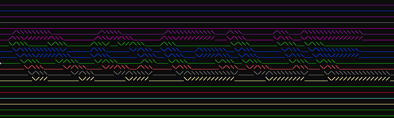
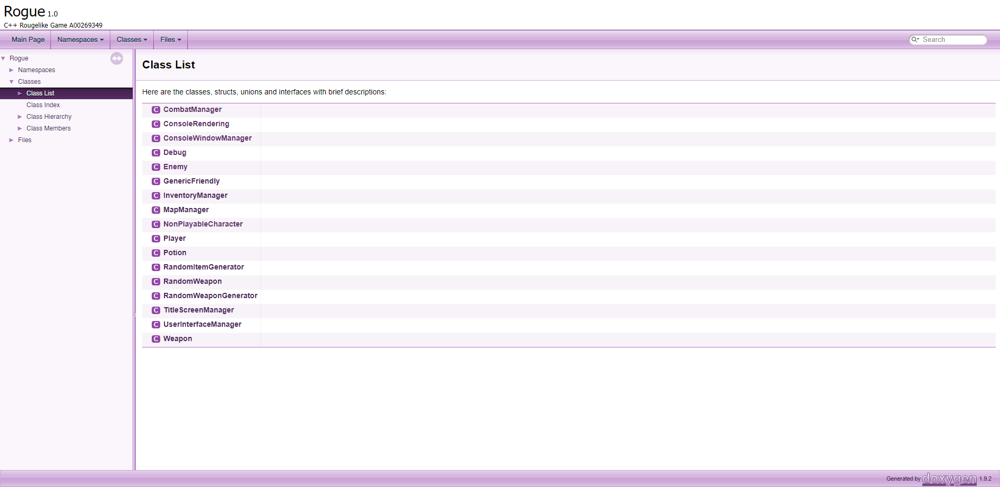
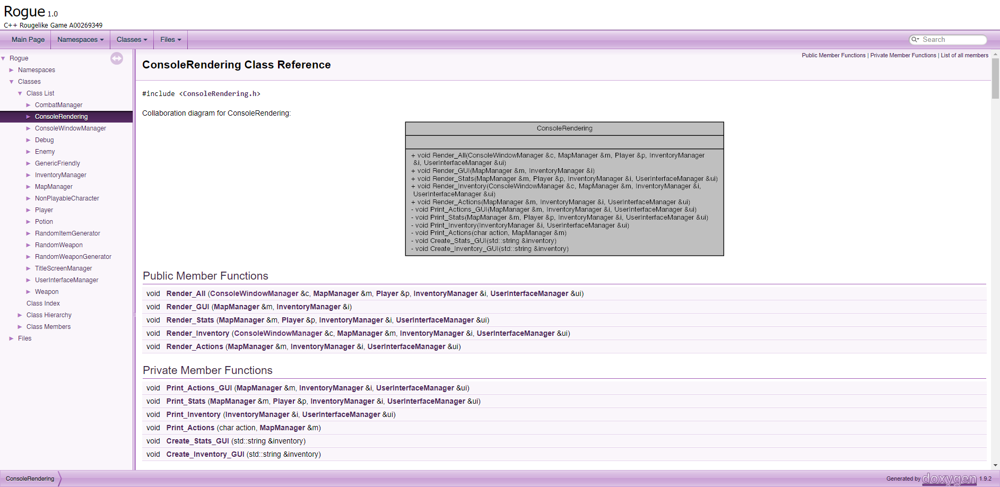
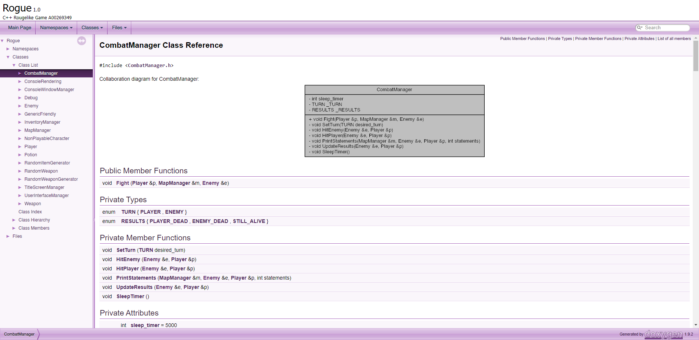
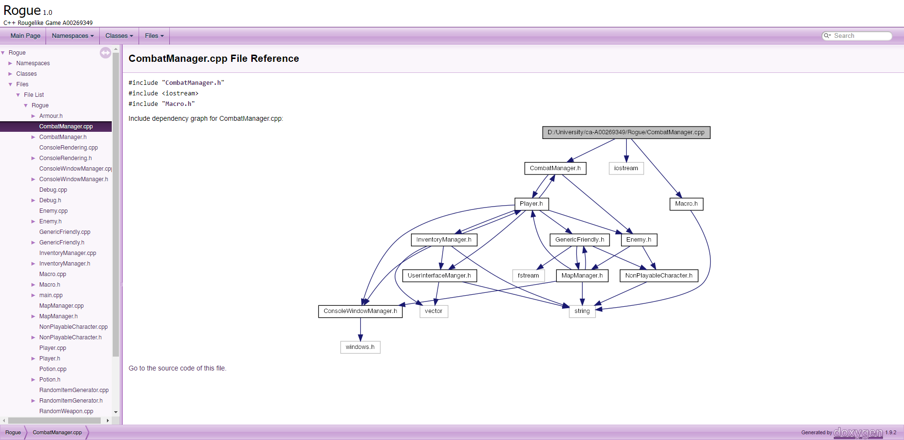
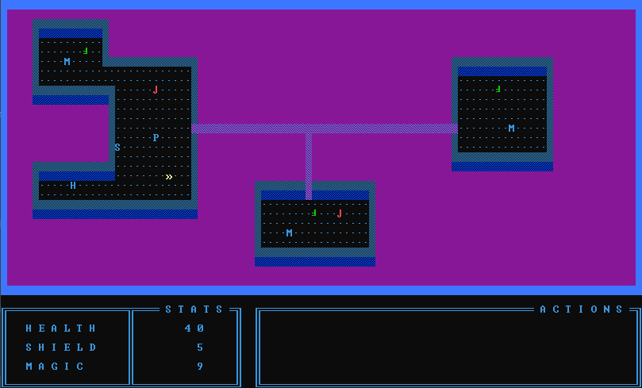
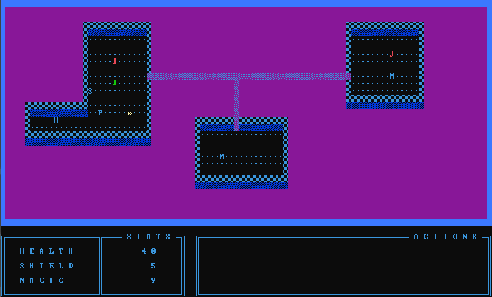
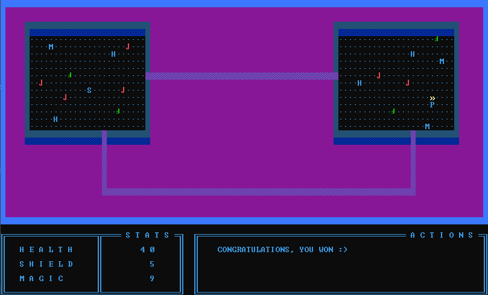
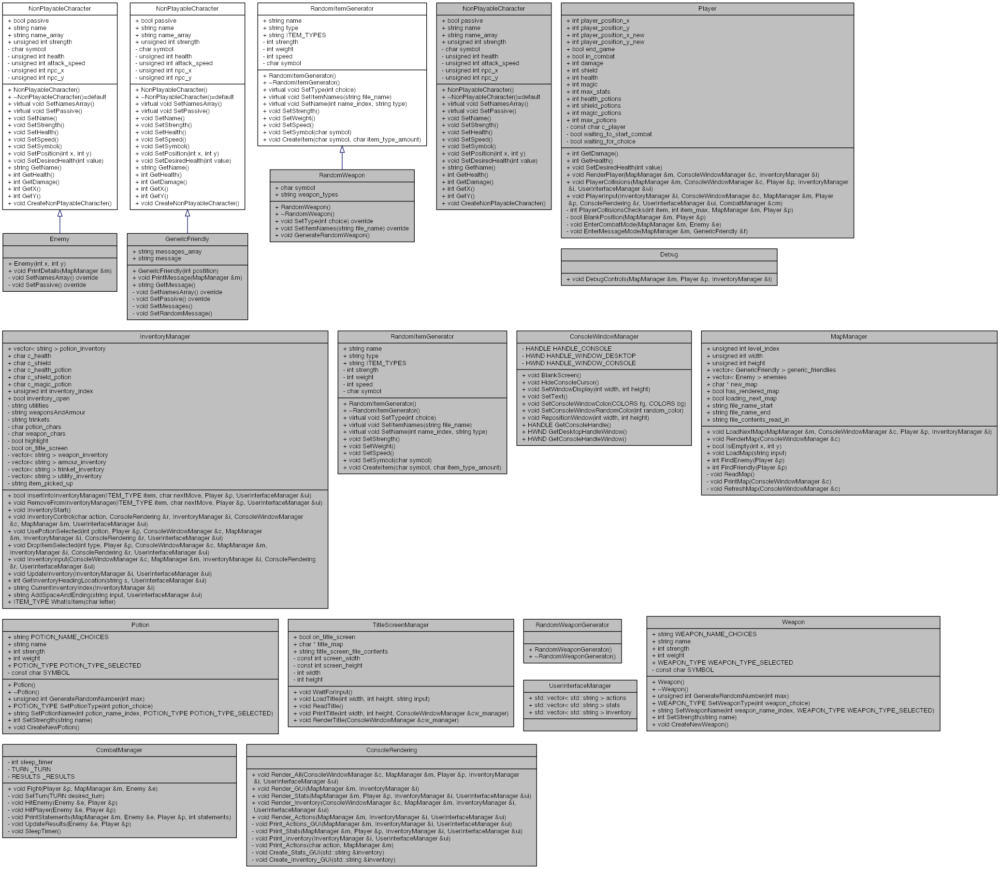

# Rogue C++ Game

A c++ game which implemtents object orienteted programming to create an optimised and fully functional rogue game

## Documentation

This program utilises [Doxygen](https://www.doxygen.nl/index.html) to create full documentation for the entire project. To view the full documentation, follow the steps as shown below.

#### Instructions

  1. Open the project in your file explorer
  2. Open the folder called **Documentation**
  3. Open the folder called **html**
  4. Either scroll down till you find a file called **index.html** or search *index* in the search bar and select **index.html**
  5. Double click on the file to open the documentation in a html web page format

## Feature Requests

### Project Feature I 
-  [X] Pick-up an item

-  [X] Drop an item

-  [X] Maintain multiple items

-  [X] Interface to inventory i.e. allows using to use/drop a particular item

-  [X] Support dropping multiple item in the same location

The player is able to pick up and drop items in their inventory. To open the inventory the player should press the `t` key. Then, to use an item, the player can press the `enter` key and to drop and item the player can press the `backspace` key.

It supports multiple item dropping by dropping it around or on top of the first location and being able to pick up all the items by walking over it.

### Project Feature II 
-  [X] Dynamically allocate the map array based on the level size

The game supports various maps by reading in the map from text files and producing them on the screen. There are 7 maps in total, and these maps load in one after the other.

### Project Feature III 
-  [X] Objectifying the code

The project has utilizes OOP to the fullest with multiple layers of inheritance and various classes which all interact with each other.

-  [X] Enemy NPC’s and a combat system

-  [X] Passive and aggressive enemies

-  [X] Friendly NPC’s and some form of interaction system

The combat system is akin to those of Final Fantasy or one of the first Rogue games. The combat is predetermined. The player will walk into an enemy and the combat manager will take in the player and enemy details and stats, and fight them against each other in a turn based style. 

As for friendly npc's, these are littered around the map at various places. Walking into them will allow them to speak to you and offer you either health, magic or shields. the player can then choose which one they want and move on in their game. 

## Media

### Documentation

### Gameplay

### UML Diagrams

